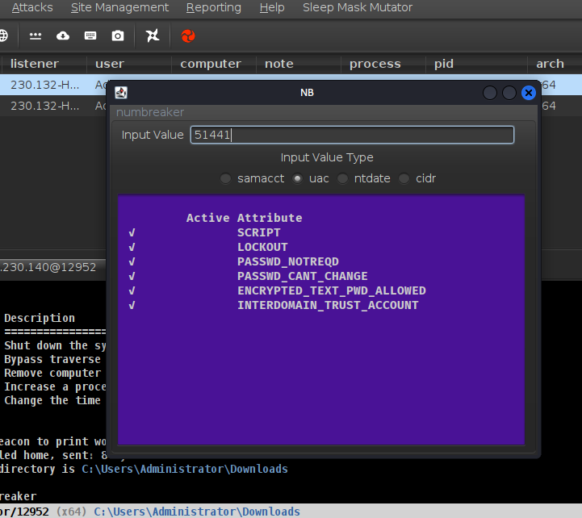

# numbreaker

### Overview
A Cobalt Strike Aggressor Script to assist an operators in conversions of common numerical types into human understandable types.
Supports converting from:  

   - User Account Control values that are associated to an accounts in Active Directory.  
   - Common Microsoft timestamps. ie Active Directory (e.g. accountExpires, LastLogon, LastLogonTimestamp, and LastPwdSet) or Windows Filetime/Systemtime values.  
    
### Usage

1) Install the Aggressor Script into your Cobalt Strike Client.
2) In a beacon window type `numbreaker`
3) Enter in a numerical value in the new pop-up window
4) Select the type of conversion that is desired by clicking on the appropriate radial dial buttons.

Alterntively, once can install as a right-click pop-up in your Cobalt Strike default.cna. Reference the [manual](https://hstechdocs.helpsystems.com/manuals/cobaltstrike/current/userguide/content/topics_aggressor-scripts/as_cobalt-strike.htm) for more info.

### Caveats

The radial option for berval is currently NOT IMPLEMENTED. It's a placeholder until one day I drum up one more numerical option that can be converted clientside for operators.

## Screenshots

MSAD/LDAP/NT Datetime

User Account Control
